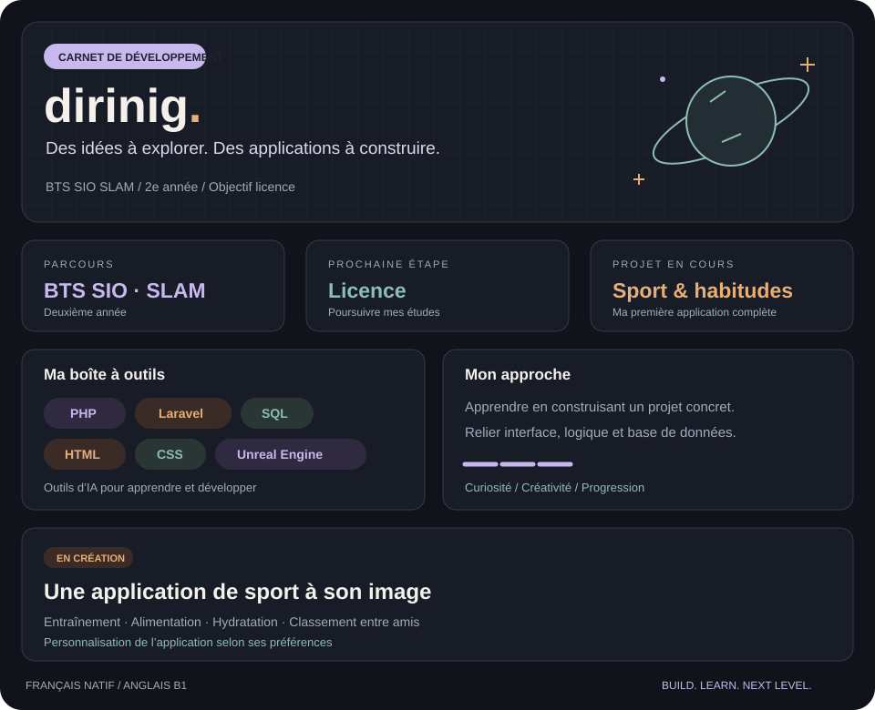

  

### Construire, apprendre, progresser

Étudiant en deuxième année de **BTS SIO option SLAM**, je développe mes compétences en construisant ma première application complète. Je souhaite poursuivre mes études en **licence** l’année prochaine.

Mon projet actuel associe **programme sportif, alimentation et hydratation**, avec un classement entre amis et une interface personnalisable. Il me permet d’apprendre à relier les différentes parties d’une application, de l’interface à la base de données.

**Technologies :** PHP · Laravel · HTML · CSS · SQL · Unreal Engine  
**Langues :** français natif · anglais B1

<!-- Les liens LinkedIn, portfolio et e-mail seront ajoutés lorsque leurs adresses publiques seront fournies. -->
